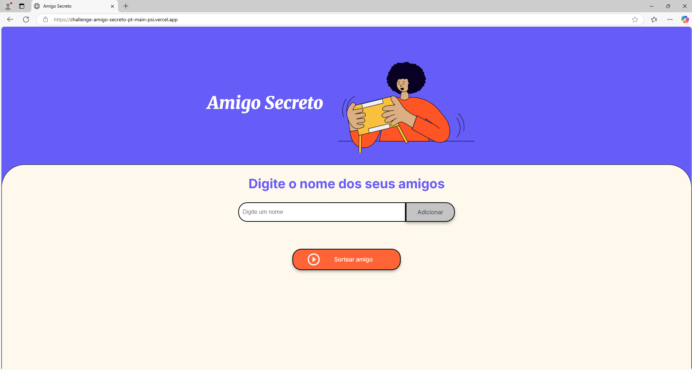

# Projeto Challenge Amigo Secreto

## Descrição
Este projeto é uma aplicação para gerenciar um amigo secreto.

## Funcionalidades
- Cadastro de participantes
- Sorteio de amigo secreto
- Envio de notificações


## 🚀 Tecnologias
<div>
  
  
  
</div>

## Link para Acesso ao Projeto

<div>
    <div>
        <a href="https://challenge-amigo-secreto-pt-main-psi.vercel.app/">
            
        </a>
    </div>
</div>

## Contribuição
1. Faça um fork do projeto
2. Crie uma branch para sua feature:
    ```bash
    git checkout -b minha-feature
    ```
3. Commit suas mudanças:
    ```bash
    git commit -m 'Minha nova feature'
    ```
4. Faça um push para a branch:
    ```bash
    git push origin minha-feature
    ```
5. Abra um Pull Request

## Contato

| [<br><sub>Marivaldo Júnior</sub>](https://github.com/marivajsj) |
| :---: |